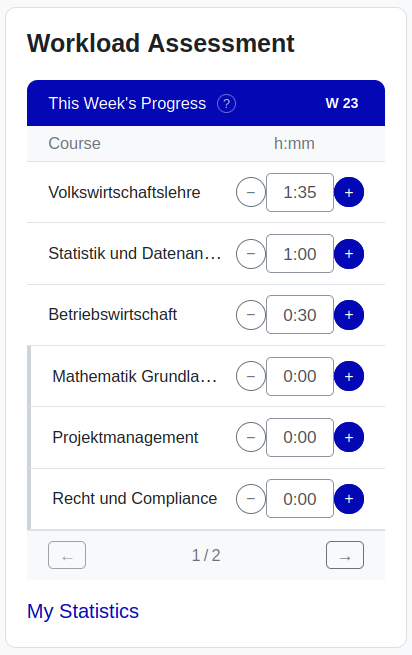
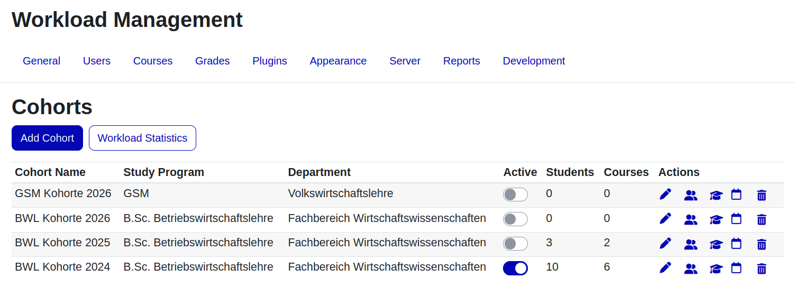
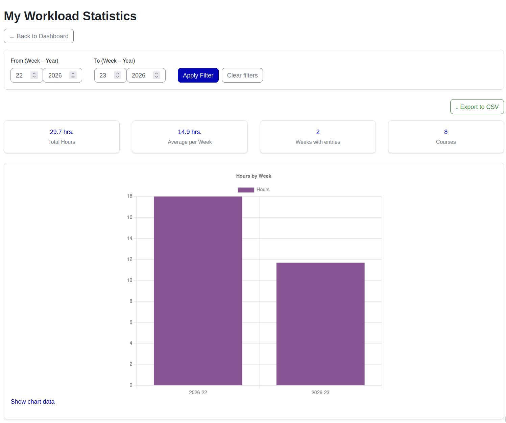

# Workload Assessment Block for Moodle

A Moodle block plugin that lets students log the hours they spend on each course every week, and gives quality managers rich statistics on students workload across the entire semester.

## Features

### Student Dashboard Block
- **Weekly time logging**: Students enter hours spent per course directly in the block widget using `+` / `−` buttons or a time input in `h:mm` format ([screenshot](screenshots/block_workload.png))
- **Configurable step size**: Each button click adds or subtracts a configurable number of minutes (default: 30 min) up to a configurable weekly maximum per course (default: 40 hrs)
- **Unlogged course indicator**: Courses with no hours recorded yet are flagged with a red `!` warning icon so students can spot gaps at a glance
- **Course display order**: Show courses sorted by most recently accessed or by the Quality Manager's manual sort order
- **Quick navigation**: A "My Statistics" link at the bottom of the block takes students directly to their personal statistics page

### Workload Management (Quality Manager)
- **Cohort dashboard**: Create and manage student cohorts with a name, study programme, and department ([screenshot](screenshots/workload_management.png))
- **Activation periods**: Set a from/to week–year range per cohort; cohorts outside their active period are automatically inactive
- **Member management**: Add students by name/email search, or in bulk by department or institution filter, or by importing from any existing Moodle System Cohort
- **A-Z filtering**: All member and course lists support A-Z quick-filter bars and configurable per-page counts (25 / 50 / 100 / all)
- **Course assignment**: Browse the Moodle course category tree and assign courses to a cohort; reorder them with up/down controls; toggle individual courses active/inactive per cohort
- **Bulk operations**: Select multiple members or courses for bulk removal in a single action

### Workload Statistics (Quality Manager)
- **KPI summary cards**: Total students, total courses, weeks with entries, and total hours logged — all updated live when the date-range filter is applied ([screenshot](screenshots/qm_statistics.png))
- **Average hours / Student chart**: Line chart (or bar chart for ≤ 12 weeks) showing the per-student average across the cohort over time
- **Active students chart**: Parallel chart showing how many distinct students logged hours each week — makes semester engagement patterns and exam-period surges immediately visible
- **Top 10 students pie chart**: Proportional breakdown of total hours by the ten highest-contributing students ([screenshot](screenshots/qm_statistics_2.png))
- **Student table**: Full list of students with total hours, weeks with entries, and average hrs/week; filterable by first or last name initial
- **Date range filter**: Restrict all charts and KPIs to any from/to week–year window; select a specific cohort or view all cohorts combined
- **View individual student**: One-click navigation from the table to any student's personal statistics page
- **CSV export**: Download a full cohort summary (one row per student) or a detailed export (one row per student per week per course) directly from the statistics page

### My Workload Statistics (Student / Manager view-as)
- **Personal KPI cards**: Total hours, average hours per week, weeks with entries, and number of courses tracked ([screenshot](screenshots/my_statistics.png))
- **Hours by Week chart**: Bar or line chart of the student's total weekly hours, with the chart type adapting automatically to the date range
- **Hours by Course – Week**: Pie chart showing the distribution of hours across courses for any selected week, with a week-selector dropdown ([screenshot](screenshots/my_statistics_2.png))
- **Collapsible week table**: Week-by-week summary rows that expand inline to reveal the per-course breakdown for that week
- **Date range filter**: Students can narrow their view to any semester or custom date window
- **CSV export**: Students can download their own data as a CSV
- **Manager view-as**: Quality managers can open any student's personal statistics page directly from the cohort student table

### Course Management Mode
Two modes control how courses appear in students' block widgets:

| Mode | Behaviour |
|------|-----------|
| **Cohort** *(default)* | Courses are determined solely by the Quality Manager's cohort course assignments |
| **Enrollment** | Courses are sourced from the student's actual Moodle enrolments; managers can exclude individual enrolled courses or manually add extra ones per student ([screenshot](screenshots/enrollment_mode.png)) |

In Enrollment mode the "Manage Student Courses" table shows, for each student: enrolled count, excluded count, manually added count, and total courses currently shown.

### Admin Settings ([screenshot](screenshots/admin_settings.png))
- **Maximum hours per course per week**: Upper limit a student can log for a single course in one week (default: 40)
- **Courses per page in block**: How many courses the block widget shows before paging (0 = always show all)
- **Increment per click**: Minutes added or subtracted per button click (default: 30)
- **Course display order**: Recently accessed (default) or Quality Manager sort order
- **Course management mode**: Cohort or Enrollment (see above)
- **Allow import from Moodle System Cohorts**: When enabled, adds an "Import from Moodle Cohort" panel on the Manage Members page for bulk enrolment from any existing system cohort

## Screenshots

### Student Block Widget

The block shows this week's ISO week number and lists all assigned courses. Students log hours with `+` / `−` buttons; the red `!` icon highlights courses not yet touched this week.

### Workload Management

The Quality Manager dashboard lists all cohorts with their study programme, department, active/inactive toggle, member count, and course count. Action icons give quick access to edit, members, courses, activation period, and delete.

### Workload Statistics — Charts

KPI cards at the top summarise the selected cohort and date range. The two side-by-side charts show **Average hours / Student** and **Active students** per week — both charts move together, making engagement dips (e.g. mid-semester break) and exam-period surges immediately visible.

<strong>📸 More statistics screenshots ▼</strong>

#### Top Students and Student Table

The "Top 10 Students by Hours" pie chart gives a proportional overview of who is driving the most workload. Below it, a filterable, table lists every student with their total hours, weeks active, and average hours per week.

### My Workload Statistics

Each student's personal statistics page opens with four KPI cards followed by a bar chart of weekly totals. The date-range filter and CSV export are available at the top.

<strong>📸 More My Statistics screenshots ▼</strong>

#### Hours by Course – Week Breakdown

A week-selector dropdown drives a pie chart showing how hours were distributed across courses for that week. The collapsible "Hours by Week" table below lets students drill into any week's per-course detail without leaving the page.

### Enrollment Mode — Manage Student Courses

When Course Management Mode is set to **Enrollment**, the manager sees a per-student table with enrolled, excluded, added, and total-shown counts, and can fine-tune each student's visible course list individually.

### Admin Settings

All site-wide defaults are configurable under **Site Administration → Plugins → Blocks → Workload Assessment**.

## Requirements

- **Moodle**: 4.5 or higher
- **PHP**: 7.4 or higher

## Installation

### Method 1: Via Moodle Admin Interface (Recommended)

1. Download `block_workload.zip`
2. Log in to Moodle as administrator
3. Navigate to: **Site administration → Plugins → Install plugins**
4. Upload `block_workload.zip` and click **"Install plugin from the ZIP file"**
5. Follow the on-screen prompts to complete installation

### Method 2: Manual Installation

1. Extract `block_workload.zip` and upload the `workload` folder to `/path/to/moodle/blocks/`
2. Set permissions: `chown -R www-data:www-data workload`
3. Visit **Site administration → Notifications** and follow the upgrade prompts

### Post-Installation: Assign the Quality Manager Role

The plugin automatically creates a `workload_manager` role during installation. You must assign this role to every user who should have access to Workload Management and Statistics.

1. Go to **Site administration → Users → Permissions → Assign system roles**
2. Click **Workload Manager**
3. Search for the user(s) and move them to the **Assigned users** list
4. Click **Save changes**

> **Note:** Without this role, users will not see the Workload Management link, cannot access cohort administration, and cannot view the aggregate statistics page.

## Usage

### For Students

1. Add the **Workload Assessment** block to your dashboard or course page
2. Each week, enter the hours you spent on each listed course using the `+` / `−` buttons or by typing directly in the `h:mm` field
3. Click **My Statistics** to view your personal workload history and trends

### For Quality Managers

1. Navigate to **Workload Management** (link in the block or via site administration)
2. Create a cohort and assign students and courses to it
3. Optionally set an activation period (from/to week–year) for the cohort
4. View aggregate statistics via **Workload Statistics**, or drill into individual student stats via the student table

### Supported Languages

- English
- German
- Ukrainian

## Version

Current version: **1.0.0** (Build: 2026060404, Stable)

## License

This plugin is licensed under the [GNU GPL v3 or later](LICENSE).

## Credits

Original plugin: Yurii Lysak (2026)  
HNEE (Hochschule für nachhaltige Entwicklung Eberswalde)

## Support

For bug reports and feature requests, please [open an issue](https://github.com/lysak-yurii/moodle-block_workload/issues).
